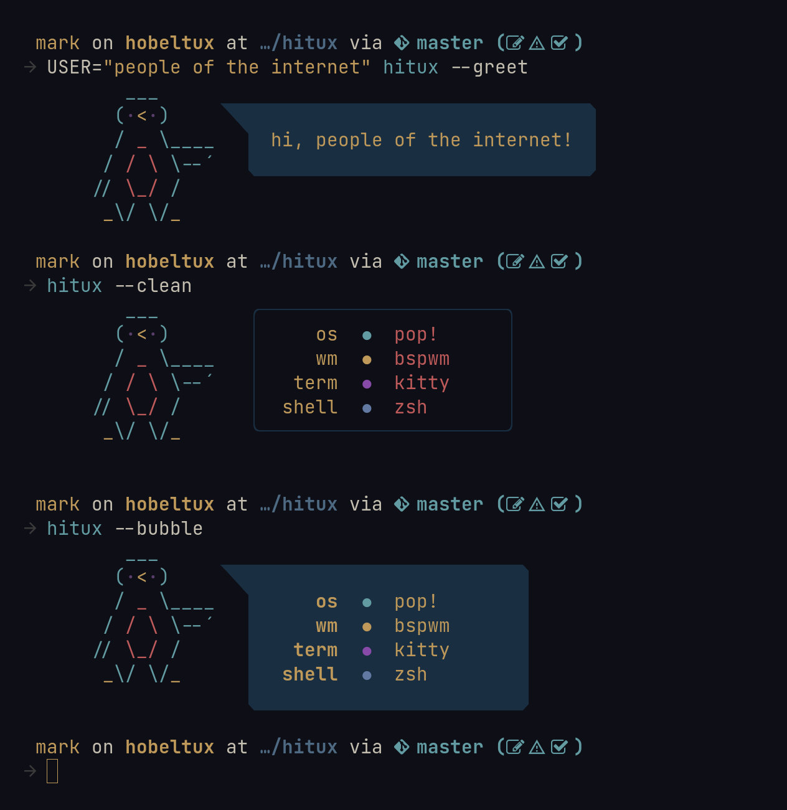

# 🐧 hitux

Penguin-themed shell script to display hardcoded system information or greet the user.

---

### Preview



---

### Installation

Just move or symlink `hitux` into a directory on `$PATH`!

Or just copy the following commands in order,
assuming `/usr/bin` is on you `$PATH`:

1.
    ```sh
    git clone https://gitlab.com/m-hgn/hitux.git ~/.hitux.tmp
    ```
2.
    ```sh
    chmod +x ~/.hitux.tmp/hitux
    ```
3.
    ```sh
    sudo mv ~/.hitux.tmp/hitux /usr/bin/
    ```

---

### Configuration

As the script is a **fake** fetch script and just for aesthetic purposes, the configuration is for now done by:
* changing the plaintext, which is displayed
* changing the variables, containing color and format codes.
